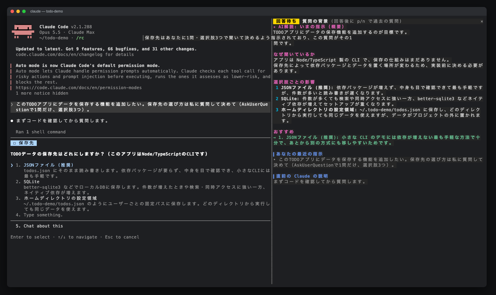
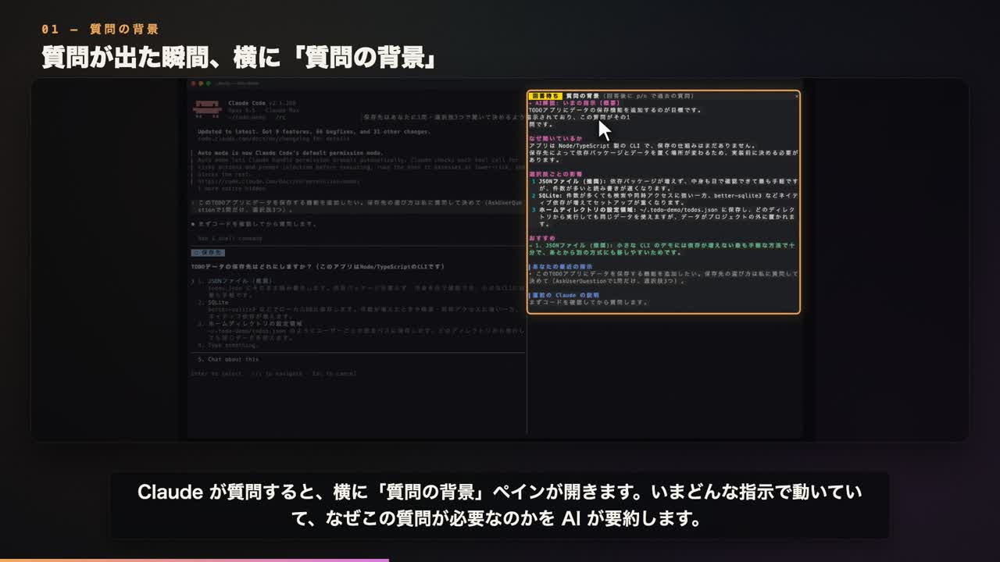
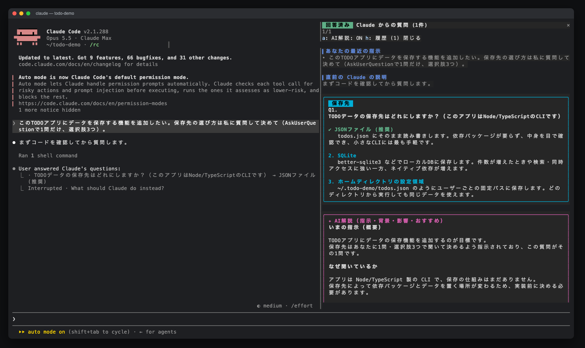
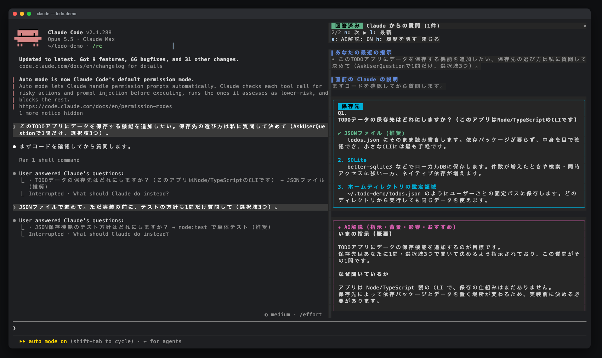
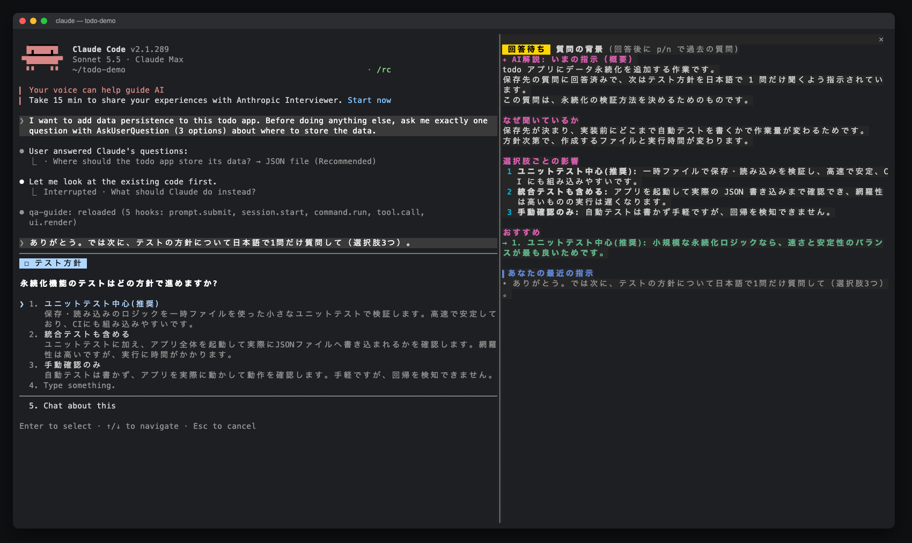

# claude_qamods

日本語 · [English](README.md)

Claude の質問を読みやすく、答えやすくする Claude Code の mod 集です。

最初の mod **qa-guide** は、Claude が `AskUserQuestion` で質問するたびに横にペインを開きます。ペインには、Claude が**なぜ**聞いているのか、**それぞれの選択肢を選ぶと何が起きるのか**が表示されます。会話をさかのぼって確認しなくても、そのまま答えられます。



[](docs/media/qa-guide-pv-16x9.mp4)

▶ デモ動画: [横長 16:9](docs/media/qa-guide-pv-16x9.mp4) · [縦長 9:16](docs/media/qa-guide-pv-9x16.mp4)

## 目次

- [作った理由](#作った理由)
- [機能](#機能)
- [動作要件](#動作要件)
- [インストール](#インストール)
- [使い方](#使い方)
- [仕組み](#仕組み)
- [プライバシーとコスト](#プライバシーとコスト)
- [困ったとき](#困ったとき)
- [開発](#開発)
- [コントリビュート](#コントリビュート)
- [クレジット](#クレジット)
- [ライセンス](#ライセンス)

## 作った理由

Claude の質問ダイアログに表示されるのは、質問文と短い選択肢だけです。セッションが長くなると、何についての質問なのかが分からなくなりがちで、答える前に会話をさかのぼって確認することになります。qa-guide は、その確認に必要な情報をダイアログの横に表示します。

## 機能

**質問に答えている間**（コンパクト表示。スクロールなしでペインに収まります）

- **AI 解説**（セッションの会話をもとに裏で生成します）
  - いま Claude が従っている指示の概要
  - なぜ今この質問をしているのか
  - 選択肢ごとの影響（ダイアログと同じ番号で並びます）
  - おすすめの選択肢（1 行）
- **あなたの最近の指示**: あなたが入力したプロンプトだけを表示します。タスクの通知などのシステムメッセージは除きます。
- **直前の Claude の説明**（末尾）
- 質問文と選択肢は、ダイアログに出ているので重ねて表示しません。

**回答したあと**（全文表示）

- 説明とプレビューつきの選択肢カード。選んだ答えには緑の ✔ が付きます
- 自由記述の回答と複数選択の回答にも対応します（カンマを含むラベルも正しく扱います）
- 直近 20 件の質問の履歴。`p` / `n` / `l` で 1 件ずつ移動するか、一覧から開きます

| 回答後の全文表示 | `p` / `n` で履歴をさかのぼる |
| --- | --- |
|  |  |

## 動作要件

- **Claude Code 2.1.286 以降**。function hooks のプラグイン API を使っています。この API は **early access** で、リリースごとに変わる可能性があります。
- ターミナル（フルスクリーンモード推奨）。幅が **144 列以上**あるとペインが自動で開きます。それより狭い場合も、`/qa-guide` で開けます。
- ペインの表示と AI 解説は**日本語と英語**に対応しています。標準では自動で選びます。詳しくは[使い方](#使い方)を見てください。

## インストール

Claude Code の中で次の 2 つを実行します。

```text
/plugin marketplace add aieo-product/claude_qamods
/plugin install qa-guide@claude-qamods
```

インストール時に `1 userConfig option not yet set` と表示されることがありますが、対応は不要です。`language` オプションの既定値は `auto` です。言語を選びたい場合は、`/plugin configure qa-guide@claude-qamods` か `/config` で設定してください。

更新は `/plugin marketplace update claude-qamods` のあとに `/plugin update qa-guide@claude-qamods`、アンインストールは `/plugin uninstall qa-guide@claude-qamods` です。

## 使い方

Claude が質問すると、ダイアログの横にペインが開きます。回答はいつもどおりダイアログで行います。

言語設定の初期値は `auto` です。質問文または選択肢のラベルにひらがな・カタカナが含まれていれば日本語、それ以外は英語でペインと AI 解説を表示します。中国語だけの文も英語になります。履歴は作成時に選んだ言語を保持し、旧バージョンで保存した履歴は日本語で表示します。



言語を固定するには、`/config` で qa-guide の `language` を `en`（英語）または `ja`（日本語）に設定します。`auto` に戻すと自動選択になります。質問がまだない場合の自動選択は、Claude Code の言語設定があればそれを優先します（日本語なら日本語、それ以外の言語なら英語）。次にロケール（`LC_ALL`、空なら `LANG`）を参照し、`ja` で始まれば日本語、それ以外は英語を使います。

| 操作 | 場所 | 動作 |
| --- | --- | --- |
| `/qa-guide` | プロンプト | ガイドを開く（最初の質問の前でも開けます） |
| `p` / `n` | ペインにフォーカス中 | 前の（古い）質問 / 次の（新しい）質問 |
| `l` | ペインにフォーカス中 | 最新の質問に戻る |
| `h` | ペインにフォーカス中 | 履歴一覧の表示を切り替える |
| `a` | ペインにフォーカス中 | 次の質問からの AI 解説を ON / OFF する |
| `Ctrl+X` → `Tab`、またはクリック | どこでも | キーボードのフォーカスをペインに移す |
| `Esc` | ペインにフォーカス中 | フォーカスをプロンプトに戻す |

質問ダイアログが出ている間はダイアログがキーボードを握るので、ペインはスクロールできません。そのため、回答中はスクロールなしで収まるコンパクト表示にしています。回答したあとの全文表示はスクロールできます。

## 仕組み

qa-guide は 1 つの hooks module（`plugins/qa-guide/hooks/register.tsx`）でできています。

| フック | 役割 |
| --- | --- |
| `prompt.submit` | あなたが入力した直近 5 件のプロンプトを記録する（origin が `composer`・`bridge`・`sdk` のもの） |
| `tool.call`（`AskUserQuestion`） | 文脈を集めてペインを開き、AI 解説の生成を回答を待たせない形で始め、ダイアログの回答を待って保存する |
| `ui.render`（`Pane`） | 質問中はコンパクト表示、回答後は全文表示を描く |
| `session.start` / `command.run` | `/qa-guide` を登録して処理する |

AI 解説には `$.model.fork` を使います。セッションの既存の会話に対して、ツールなしの質問を 1 回だけ投げる API です。解説は読んでいる間に届き、ダイアログを待たせることはありません。セッションの最初の応答より前に Claude が質問した場合は、まだ fork できる会話がありません。そのときは、あなたの最近の指示・質問直前の Claude の説明・質問だけを使って、`$.model.complete` で `haiku` に 1 回だけ問い合わせます。状態は `$.state` に持つので、ホットリロードでは消えず、セッションが終わると消えます。

## プライバシーとコスト

- **セッションの外には何も送りません。** qa-guide が独自に通信することはありません。AI 解説は、セッションがすでに使っているアカウントで Claude Code を通して送る追加リクエスト 1 回です。通常は同じ会話を同じモデルで fork し、最初の応答より前の質問だけは、指示と質問文を `haiku` に送ります。
- **ディスクには何も書きません。** プロンプト・質問・回答はセッションのメモリ（`$.state`）にだけ置き、セッションが終わると消えます。
- **コスト。** AI 解説が ON の場合、質問 1 件ごとにモデル呼び出しが 1 回増えます。`a` で OFF にできます。ペインの表示自体はモデルを呼びません。

### 質問 1 回あたりのトークン消費

| | 送るもの | トークン数の目安 |
| --- | --- | --- |
| **ペインの表示（AI なし）** | なし。最近の指示と直前の説明は、手元のセッションから読みます。 | 0 |
| **AI 解説（通常）** | セッションの会話全体を fork し、qa-guide の指示文・最近の指示 3 件（各 600 文字まで）・質問を足して送ります。 | 会話全体: プロンプトキャッシュから読み込み（セッションの会話の長さ分）<br>追加の入力: 約 1,000〜3,000<br>出力: 約 500〜1,000（モデルが考える分、増えることがあります） |
| **AI 解説（フォールバック）** | 最初の応答より前に Claude が質問した場合だけ。qa-guide の指示文・最近の指示・直前の Claude の説明（末尾 2,500 文字）・質問を送ります。会話全体は送りません。 | 入力: 約 1,500〜4,000<br>出力: 最大 1,500 |

- **使うモデル。** fork は、そのときセッションで使っているモデルで動きます。`/model` で切り替えたり、Claude Code の既定モデルが新しくなったりすると、それに合わせて変わります。フォールバックは `haiku` という別名で指定していて、Claude Code がその時点の Haiku に解決します。
- **キャッシュが効かない場合。** fork で送る会話の先頭部分は、直前のメインのリクエストとまったく同じなので、通常はプロンプトキャッシュから読まれます。キャッシュの期限が切れていたり、`/model` で切り替えた直後だったりすると、会話全体が 1 回分、通常の入力として処理されます。
- **プラン。** Pro / Max プランで使っている場合、これらのトークンはトークン単位の課金ではなく、プランの利用枠として消費されます。

## 困ったとき

| 症状 | 対処 |
| --- | --- |
| Claude が質問してもペインが開かない | ターミナルの幅が 144 列未満です。幅を広げるか、`/qa-guide` を実行してください。この場合はトーストで知らせます。 |
| `/qa-guide` が認識されない | `/plugin` で `qa-guide@claude-qamods` がインストール済みで有効になっているかを確認し、新しいセッションを始めてください。 |
| AI 解説が「生成できませんでした」になる | モデルへのリクエストが失敗したか、空の応答が返りました（API エラーやレート制限など）。ペインのほかの部分は使えます。次の質問では再度生成を試みます。 |
| Claude Code を更新したら何も表示されない | early access の API が変わった可能性があります。Claude Code のバージョンを添えて [issue を作成](https://github.com/aieo-product/claude_qamods/issues/new/choose)してください。 |

## 開発

```sh
git clone https://github.com/aieo-product/claude_qamods
cd claude_qamods
claude --plugin-dir plugins/qa-guide        # セッションで試す
```

チェック:

```sh
claude plugin validate .                    # マーケットプレイスの manifest
claude plugin validate plugins/qa-guide     # プラグインの manifest と hooks module
claude plugin test plugins/qa-guide         # terminal / desktop の 2 サーフェスでテスト
npx -y -p typescript@5 tsc -p plugins/qa-guide --noEmit
```

型チェックには、engine が書き出す型定義（`plugins/qa-guide/.claude-plugin/types/`）が必要です。このファイルは gitignore 済みで、手元のチェックアウトからプラグインを初めて読み込んだときに Claude Code が書き出します。開発の流れは [CONTRIBUTING.md](CONTRIBUTING.md) を見てください。

## コントリビュート

issue や pull request を歓迎します。[CONTRIBUTING.md](CONTRIBUTING.md) と[行動規範](CODE_OF_CONDUCT.md)を読んでください。セキュリティ上の問題は [SECURITY.md](SECURITY.md) の手順で報告してください。

## クレジット

- デモ動画のナレーション: Irodori-TTS v4-Large（Gemma Terms of Use）
- デモ動画の音楽と効果音: このプロジェクトのために合成したオリジナル
- スクリーンショットとデモ動画は、使い捨てのデモ用プロジェクトで撮影しています

## ライセンス

[MIT](LICENSE) © aieo-product
